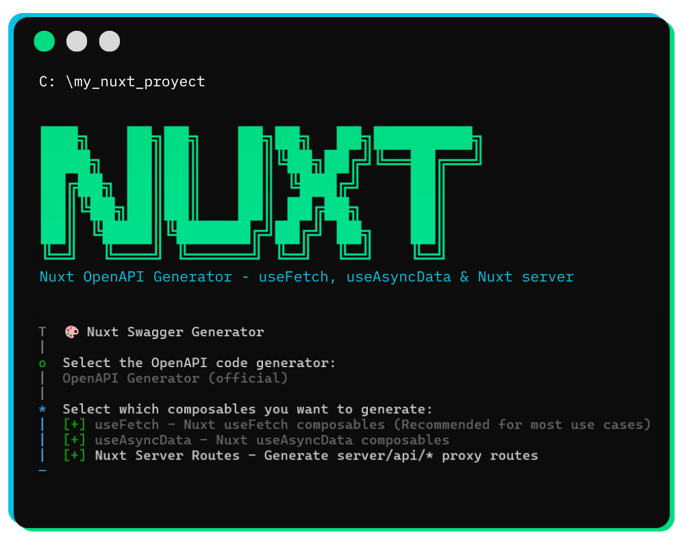

<p align="center">
  
</p>

# 🚀 Nuxt OpenAPI Generator

**Generate type-safe, SSR-compatible Nuxt composables from OpenAPI/Swagger specifications.**

📖 **[Full documentation → nuxt-openapi-hyperfetch.netlify.app](https://nuxt-openapi-hyperfetch.netlify.app/)**

---

Transform your API documentation into production-ready **100% Nuxt-native** code—`useFetch` composables, `useAsyncData` composables, and Nuxt Server Routes—with full TypeScript support, lifecycle callbacks, and request interception. Use it either as a CLI with `nxh generate` or as a Nuxt module wired directly from `nuxt.config.ts`.

---

## ✨ Features

- 🔒 **Type-Safe**: Full TypeScript support derived from your OpenAPI schema
- ⚡ **SSR Compatible**: Works seamlessly with Nuxt server-side rendering
- 🔄 **Lifecycle Callbacks**: `onRequest`, `onSuccess`, `onError`, `onFinish`
- 🌐 **Global Callbacks Plugin**: Define callbacks once, apply to all requests
- 🛡️ **Request Interception**: Modify headers, body, and query params before sending
- 🎯 **Smart Data Selection**: Pick specific fields with dot notation for nested paths
- 🤖 **Auto Type Inference**: Transform response data with automatic TypeScript type inference
- ⚡ **Automatic Generation**: Single command generates all composables and server routes
- 💚 **100% Nuxt Native**: Generated composables use `useFetch` / `useAsyncData`; server routes use `defineEventHandler` — no third-party runtime required
- 📦 **Zero Runtime Dependencies**: Generated code only uses Nuxt built-ins
- 💡 **Developer Experience**: Interactive CLI with smart defaults

---

## 🔧 Generator Engines

Two generation engines are available. The CLI will ask you to choose one when running `nxh generate`:

| Engine | Tool | Node Native | Best for |
|--------|------|:---:|----------|
| **official** | [@openapitools/openapi-generator-cli](https://openapi-generator.tech/) | ❌ Requires Java 11+ | Maximum spec compatibility, enterprise projects |
| **heyapi** | [@hey-api/openapi-ts](https://heyapi.dev/) | ✅ Yes | Quick setup, CI/CD pipelines, Node-only environments |

> The CLI checks for Java automatically when `official` is selected and aborts with an install link if it is not found. Get Java at [adoptium.net](https://adoptium.net).

You can also pre-select the engine in your `nxh.config.js` — the CLI will skip the prompt entirely:

```js
// nxh.config.js
export default {
  generator: 'openapi',   // 'openapi' | 'heyapi'
  input: './swagger.yaml',
  output: './api',
};
```

---

## 📦 Installation

### Use as CLI

```bash
npm install -g nuxt-openapi-hyperfetch
# or
yarn global add nuxt-openapi-hyperfetch
# or
pnpm add -g nuxt-openapi-hyperfetch
```

Or use directly with npx:

```bash
npx nuxt-openapi-hyperfetch generate
```

### Use as Nuxt module

Install it in your Nuxt project:

```bash
npm install -D nuxt-openapi-hyperfetch
# or
pnpm add -D nuxt-openapi-hyperfetch
# or
yarn add -D nuxt-openapi-hyperfetch
```

Then register the module in `nuxt.config.ts`:

```ts
export default defineNuxtConfig({
  modules: ['nuxt-openapi-hyperfetch'],

  openApiHyperFetch: {
    input: './swagger.yaml',
    output: './composables/api',
    generators: ['useFetch', 'useAsyncData'],
    backend: 'heyapi',
    enableDevBuild: true,
    enableProductionBuild: true,
    enableAutoGeneration: false,
    enableAutoImport: true,
    createUseAsyncDataConnectors: false,
  },
})
```

The module uses `openApiHyperFetch` as its Nuxt config key and runs generation during Nuxt build hooks. If you include `nuxtServer` in `generators`, you can also configure `serverRoutePath` and `enableBff` here.

---

## 🚀 Quick Start

### 1. Run the generator with the CLI

<p align="center">
  
</p>

```bash
nxh generate
```

The CLI will ask you for:

- 📂 Path to your OpenAPI/Swagger file (`.yaml` or `.json`)
- 📁 Output directory for generated files
- 🔧 Which generation engine to use (`official` or `heyapi`)
- ✅ Which composables to generate (`useFetch`, `useAsyncData`, `Nuxt server routes`)

Or pass arguments directly:

```bash
nxh generate -i ./swagger.yaml -o ./api
```

### 2. Or generate through the Nuxt module

If you prefer generation to run from Nuxt itself, add the module and configure it in `nuxt.config.ts`:

```ts
export default defineNuxtConfig({
  modules: ['nuxt-openapi-hyperfetch'],

  openApiHyperFetch: {
    input: './swagger.yaml',
    output: './composables/api',
    generators: ['useFetch', 'useAsyncData', 'nuxtServer'],
    backend: 'heyapi',
    serverRoutePath: 'server/routes/api',
    enableBff: false,
    enableAutoImport: true,
    enableAutoGeneration: true,
  },
})
```

Useful module options:

- `input`: OpenAPI file path relative to the Nuxt root.
- `output`: Directory where the generated SDK/composables are written.
- `generators`: Any combination of `useFetch`, `useAsyncData`, and `nuxtServer`.
- `backend`: `heyapi` or `official`.
- `enableDevBuild` / `enableProductionBuild`: Control generation before dev/build.
- `enableAutoGeneration`: Regenerate when the input spec changes in dev mode.
- `enableAutoImport`: Auto-register generated composables for Nuxt auto-imports.
- `createUseAsyncDataConnectors`: Generate headless connectors on top of `useAsyncData`.
- `serverRoutePath`: Output path for generated Nuxt server routes.
- `enableBff`: Enable the BFF transformer layer for server routes.

### 3. Generated output

```
api/
+-- runtime.ts
+-- apis/
│   +-- PetApi.ts
│   +-- StoreApi.ts
+-- models/
│   +-- Pet.ts
│   +-- Order.ts
+-- composables/
    +-- use-fetch/
        +-- runtime/
        │   +-- useApiRequest.ts
        +-- composables/
        │   +-- useFetchGetPetById.ts
        │   +-- useFetchAddPet.ts
        +-- index.ts
```

### 4. Configure the API base URL

Add to `nuxt.config.ts`:

```typescript
export default defineNuxtConfig({
  runtimeConfig: {
    public: {
      apiBaseUrl: process.env.NUXT_PUBLIC_API_BASE_URL || 'https://api.example.com'
    }
  }
})
```

And in `.env`:

```env
NUXT_PUBLIC_API_BASE_URL=https://api.example.com
```

All generated `useFetch` and `useAsyncData` composables will automatically use this as `baseURL`. You can still override it per-composable via `options.baseURL`.

### 5. Use in your Nuxt app

```vue
<script setup lang="ts">
import { useFetchGetPetById } from '@/api/composables/use-fetch';

const { data: pet, pending, error } = useFetchGetPetById(
  { petId: 123 },
  {
    onSuccess: (pet) => console.log('Loaded:', pet.name),
    onError: (err) => console.error('Failed:', err),
  }
);
</script>

<template>
  <div>
    <div v-if="pending">Loading...</div>
    <div v-else-if="error">Error: {{ error }}</div>
    <div v-else-if="pet">{{ pet.name }} — {{ pet.status }}</div>
  </div>
</template>
```

---

## 🖥️ Nuxt Server Routes Generator

In addition to client-side composables, you can generate **Nuxt Server Routes** that proxy requests to your backend API—keeping API keys and secrets server-side.

```
Client → Nuxt Server Route (generated) → External API
```

After generation, configure your backend URL in `.env`:

```env
API_BASE_URL=https://your-backend-api.com/api
API_SECRET=your-secret-token
```

And add it to `nuxt.config.ts`:

```typescript
export default defineNuxtConfig({
  runtimeConfig: {
    // Private — server-side only (never exposed to the browser)
    apiBaseUrl: process.env.API_BASE_URL || '',
    apiSecret: process.env.API_SECRET || '',
  },
});
```

> **Note:** `runtimeConfig.apiBaseUrl` (private) is only for **Server Routes**. For `useFetch`/`useAsyncData` composables use `runtimeConfig.public.apiBaseUrl` instead — see the [Quick Start](#-quick-start) section above.

Then use standard `useFetch` against your Nuxt routes:

```typescript
const { data: pet } = useFetch('/api/pet/123');
```

> **BFF (Backend for Frontend) mode** is also available — generates a transformer layer for auth context, data enrichment, and permission filtering without ever overwriting your custom code. See the [Server Routes Guide](./docs/DEVELOPMENT.md) for details.

---

## 📚 Documentation

| Guide | Description |
|-------|-------------|
| [Quick Start Guide](./docs/QUICK-START.md) | Understand the project in 5 minutes |
| [Architecture](./docs/ARCHITECTURE.md) | Design patterns, two-stage generation, shared code |
| [API Reference](./docs/API-REFERENCE.md) | All CLI options, TypeScript types, composable APIs |
| [Development Guide](./docs/DEVELOPMENT.md) | Contributing, adding generators, code style |
| [Troubleshooting](./docs/TROUBLESHOOTING.md) | Common errors and solutions |

---

## 🤝 Contributing

Contributions are welcome! Please read the [Contributing Guidelines](./CONTRIBUTING.md) before submitting a PR.

```bash
# Development setup
npm install
npm run build
npm run validate   # lint + type check
```

---

## 📄 License

Apache-2.0 — see [LICENSE](./LICENSE) for details.

---

**Made with ❤️ for Nuxt developers**
